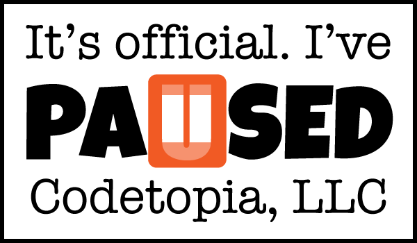



## Who the #%&amp;@* is Joe?

Joseph Hall has been a professional software developer for more than 25 years. He worked as a programmer for Microsoft and IBM, he was the software architect for a Fortune 500 bank, he was the CTO of an online ticket sales and servicing company, and he started his own consulting company (Codetopia, LLC) in 2006.

Joe makes his living writing desktop, web, and mobile device applications for businesses and governmental agencies, but game programming is his passion, and it was gaming that got him into programming in the first place. He was a member of the original Xbox team and he joined the Visual Studio .NET team just after the Xbox was released in 2001.

He is the author of *<a href="http://amzn.to/1JuxvD8" target="_blank">XNA Game Studio Express: Developing Games for Windows and the Xbox 360</a>*, which was published in 2007, and *Fauxcabulary: Fake Definitions, Real Funny*, which was self-published in 2015 (for <a href="https://leanpub.com/fauxcabulary" target="_blank">eBook</a> and <a href="http://www.lulu.com/shop/http://www.lulu.com/shop/joseph-hall/fauxcabulary/paperback/product-22179468.html" target="_blank">print</a>). He has several new books in the pipeline including a multi-volume series on MonoGame development using Xamarin Studio and a techno-thriller trilogy set in the not-so-distant future.

Joe lives with his wife and three daughters in Montgomery, Alabama. Every summer, Joe teaches high school students how to write games during an intense weeklong course in North Carolina for Landry Academy. In his free time, Joe dabbles in sketching, cartooning, and creating 3D models. When you see his artistic creations, you'll understand why he makes his living as a programmer.

## What's Codetopia?

Codetopia, LLC, was founded in 2006 as a vehicle for me to knock one more item off my bucket list -- start my own consulting company. I walked away from my 9-to-5 without a penny in savings, a plan, or even a client! In hindsight, it's not something that I would recommend to anyone looking to start their own business, but it worked out for me.

Since then, I've had more word-of-mouth work than I could handle. I took a short break in 2007 to work as the CTO of a ticket sales and service company, and I cut my commitments significantly after a health scare in 2010 -- dropping to a single client at a time.

In general, Codetopia, LLC, was created to make my contracting work official. I provide software development, training, consulting, and related IT services. As of 2015, though, Codetopia has taken a backseat to my new adventure -- working as a software developer for ThoughtWorks, Inc, in Atlanta, GA. In my new role, I'm immersed in agile, extreme programming, and test-driven development methodologies. This old dog is learning new tricks!

