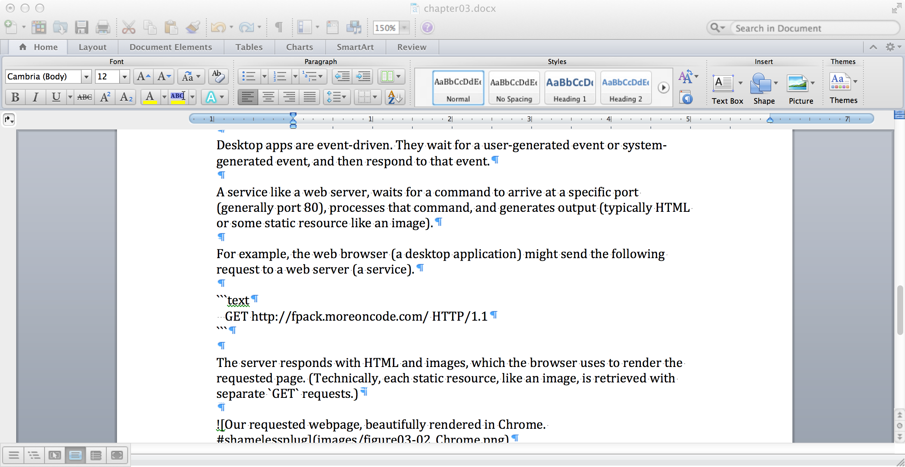
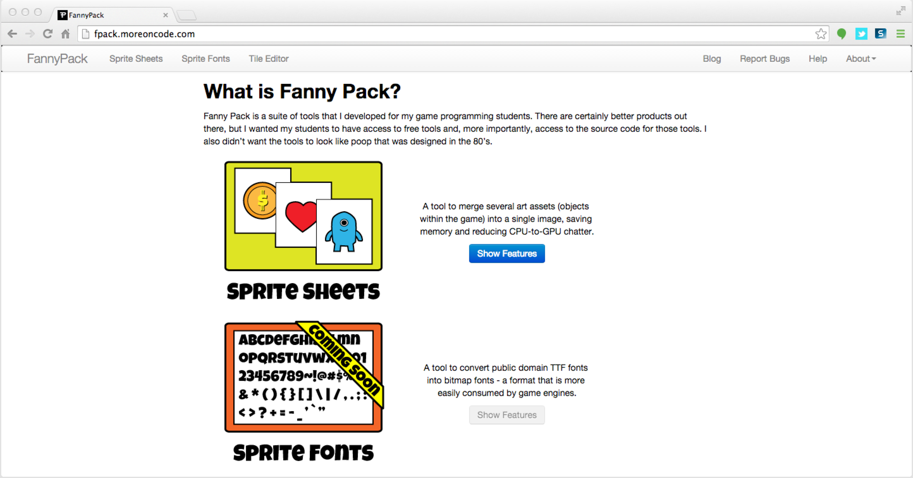
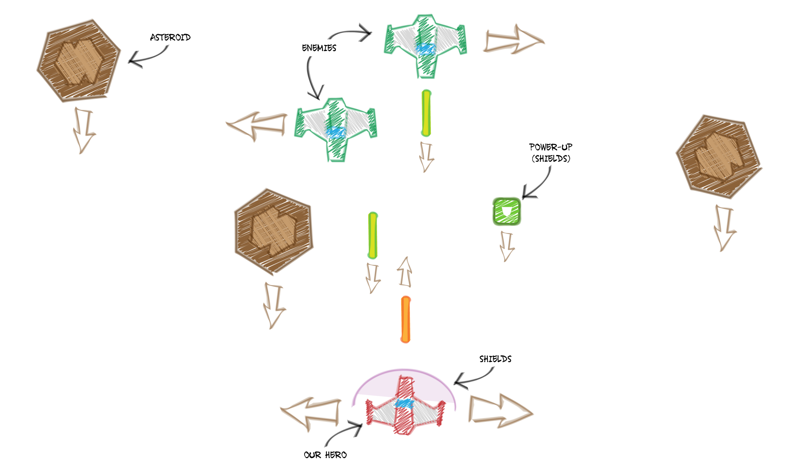



# Chapter 3: Crash Course

## Overview

This chapter presents the bare minimum that you need to know to understand the chapters that follow. If you would like to dive deeper into the concepts of programming, there are many good references out there. And, as always, google is a newbie's best friend.

This book s based on my work with the kids at camp. And, at camp, we only have five days of class time to conceive and build a working game. Most of the students have no prior experience with programming. 

Day one involves installing the tools that we'll use, discussing the game we'd like to make, and making sure that our development environments are properly configured by writing a simple "game".

We covered installing tools in the previous chapter, and you'll be selecting your preferred game genre after this chapter. This is where we'll make sure that our development environment is properly configured by building a simple game.

During that process, we will cover concepts such as variables, loops, objects, methods, and properties, along with many other techy buzzwords.

## How a Program Works

All programs work basically the same way. They take input, process it, and generate output. Programs are written for specific tasks, though. So the way that input is collected, data is processed, and output is rendered varies greatly.

One of the simplest programs is the console app. You type a command, optionally pass in parameters, and (eventually) get output. For example, you might want to see a list of files in the current directory.

```text
   josephs-mbp:~ groundh0g$ ls -lFa
   drwxr-xr-x+ 38 groundh0g  staff   1292 Sep 26 05:20 ./
   drwxr-xr-x   6 root       admin    204 Oct 28  2013 ../
   drwxr-xr-x   3 groundh0g  staff    102 Feb  5  2014 Applications/
   drwx------+ 32 groundh0g  staff   1088 Sep 26 07:06 Desktop/
   drwx------+ 21 groundh0g  staff    714 Aug 10 17:59 Documents/
   drwx------+ 67 groundh0g  staff   2278 Sep 23 19:12 Downloads/
   drwx------@ 64 groundh0g  staff   2176 Jun 12 11:14 Library/
   drwx------+  5 groundh0g  staff    170 Jul  4  2013 Movies/
   drwx------+  7 groundh0g  staff    238 Aug 31 12:55 Music/
   drwx------+  6 groundh0g  staff    204 May 16 02:05 Pictures/
   drwxr-xr-x  24 groundh0g  staff    816 Sep 16 19:06 Projects/
   drwxr-xr-x+  5 groundh0g  staff    170 Jul 23 15:06 Public/
   josephs-mbp:~ groundh0g$ 
```

A console application takes it's input from the command line or from a file, processes the command and associated options, and generates output which is printed to the console. Requested actions are processed immediately.

A desktop application spends most of its time idle, waiting for you to click a button or menu item, type some text, or drag your mouse across a canvas.



Desktop apps are event-driven. They wait for a user-generated event (e.g. clicking or typing) or system-generated event (e.g. a shutdown notification), and then respond to that event.

A service like a web server, waits for a command to arrive at a specific port (generally port 80), processes that command, and generates output (typically HTML or some static resource like an image).

For example, the web browser (a desktop application) might send the following request to a web server (a service).

```text
   GET http://fpack.moreoncode.com/ HTTP/1.1
```

The server responds with HTML and images, which the browser uses to render the requested page. (*Technically, each static resource, like an image, is retrieved with separate `GET` requests.*)



I could list countless examples, and each would follow the same basic model of receiving input, processing the input, and generating output. But, you're reading this book because you're interested in game programming. So, let's take a look at how **a game** handles input, processing, and output.

## Anatomy of a Program

Before we jump into MonoGame code, we need to cover the basic parts of a program.

```csharp
   using System;
   
   namespace Chapter03.CrashCourse
   {
      public class SampleClass
      {
         public SampleClass () { }
   
         public static void Main (string[] args)
         {
            Console.WriteLine ("Hello, World!");
         }
      }
   }
```

In this case, we have a console program that ignores command line parameters (the input), doing absolutely nothing with them (the processing), and then prints a generic welcome message (the output).

A `class` is a representation of a (usually) real-world object. A `namespace` is analogous to a folder in a file system. So our class' fully-qualified name is "`Chapter03.CrashCourse.SampleClass`".

Classes may contain methods and properties. In our example, there are two methods - `SampleClass` and `Main`. The `SampleClass` method is a special method type known as a constructor. It's called once, when an instance of the class is created in memory. That's where the initialization logic lives. In our case, the constructor does absolutely nothing - much like its author.

Don't worry about the details at this point. Just try to understand what the `SampleClass` is doing at a high level. As we work through this chapter, you'll have plenty of opportunity to sweat the details.

## How a Game Works

To recap:

* Console applications are inactive until they're invoked. They spring to life, process the request, and are unloaded from memory when their tasks are complete.
* Desktop applications are launched (generally by a user), and then sit idly by, waiting for user or system events. Once an event is received, the application performs its tasks, and then returns to an idle state. The application runs until the system or (more likely) the user asks it to terminate.
* Services are launched (generally by the system), and then sit idly by, waiting for a request to come in. Once a request is received, the service performs its tasks, and then returns to an idle state. The service runs until the user or (more likely) the system asks it to terminate.

Games are slightly different beasts. The user invokes them, and then they run continuously until they're asked to terminate. Games have a heartbeat. It's called the game loop. At regular intervals, two methods of a game are invoked - `Update` and `Draw`.

The interval varies based on the game, but it's typically 1/60 of a second. 1/30 of a second is usually considered minimal for games, but your `Draw` calls can be made as infrequently as 1/12 of a second to provide smooth animations.

>**NOTE:** For reference, most TV shows refresh at around 29.97 frames per second (assuming NTSC), most theatrical and animated films refresh at around 24 frames per second, and standard quality web animations refresh at around 12 frames per second. Of course, there's a long list of specific frame rates for specific applications, but those are a common rule of thumb.

Another major difference between games and other applications is that the "take input" step is continuous. The game is constantly polling input devices, asking them if there's been any change since the last query.

The "process input" step is handled in the `Update` method. Your virtual world is constantly updated based on a variety of factors, including player input. And the "generate output" step is handled by the `Draw` method, which renders the game visuals based on the current state of in-game objects that have been refreshed in the `Update` method.

>**NOTE:** If you ever wondered why your laptop or smartphone battery drains faster when you're playing video games, now you know. The game world is refreshed and redrawn 60 times per second. That means that your code is churning through (nearly) all your game world objects in 1/60 of a second, throwing the results to the display, and as soon as that frame has been rendered the entire process starts again.

## Anatomy of a Game

Before we get started on our game for this chapter, lets cover the basic parts of the MonoGame game class.

```csharp
   using System;
   using System.Collections.Generic;
   using Microsoft.Xna.Framework;
   using Microsoft.Xna.Framework.Audio;
   using Microsoft.Xna.Framework.Content;
   using Microsoft.Xna.Framework.GamerServices;
   using Microsoft.Xna.Framework.Graphics;
   using Microsoft.Xna.Framework.Input;
   using Microsoft.Xna.Framework.Media;

   namespace Chapter03.CrashCourse
   {
      public class Game1 : Microsoft.Xna.Framework.Game
      {
         GraphicsDeviceManager graphics;
         SpriteBatch spriteBatch;
   
         public Game1()
         {
            graphics = new GraphicsDeviceManager(this);
            Content.RootDirectory = "Content";
         }
   
         protected override void Initialize()
         {
            // TODO: Add your initialization logic here
            base.Initialize();
         }
   
         protected override void LoadContent()
         {
            spriteBatch = new SpriteBatch(GraphicsDevice);
            // TODO: use this.Content to load your game content here
         }
   
         protected override void UnloadContent() { }
   
         protected override void Update(GameTime gameTime)
         {
            var buttonState = GamePad.GetState(PlayerIndex.One).Buttons.Back;
            if (buttonState == ButtonState.Pressed)
            {
               this.Exit();
            }
            // TODO: Add your update logic here
            base.Update(gameTime);
         }
   
         protected override void Draw(GameTime gameTime)
         {
            GraphicsDevice.Clear(Color.CornflowerBlue);
            // TODO: Add your drawing code here
            base.Draw(gameTime);
         }
      }
   }
```

This is a fully functioning game. It renders a blue screen, at 60+ frames per second, and constantly asks the GamePad if the Back button is being pressed. When the Back button is pressed, the game exits. It's no blockbuster, but it has all the plumbing that we need to start building our own games.

The first thing you'll notice is that there are a lot more of those `using` statements. Those are references to the libraries (like MonoGame [a.k.a. `Microsoft.XNA`]) that we will be using in our game. By including the namespace path in a `using` statement, you save typing when you reference their classes.

The fully qualified name of this class is "`Chapter03.CrashCourse.Game1`". It inherits all the methods and properties of its parent class, `Microsoft.Xna.Framework.Game`. That class does most of the heavy lifting for us, so that we can save hundreds of lines of code that perform the same tasks from game to game.

There are two member variables - `graphics` and `spriteBatch`. The former is used to query or alter the screen state. The latter is used to draw sprites (2D images). We don't have any sprites in our game yet, but we soon will.

There are six methods:

* **`Game1()`** - This is the constructor. It's called once, when the game object is created. Constructors are generally meant to be lightweight and perform as few tasks as possible. So, the `Game` class provides an `Initialize` method where we can perform initialization tasks that might be a little meatier.
* **`Initialize()`** - This is the place to set default values, and prepare any associated game data for use.
* **`LoadContent()`** - This is where assets such as images, sounds, music, and others may be loaded. Typically, you will use the inherited `Content` member variable to load your assets. If that's the case, you need not worry about "unloading" them.    
In general, you can assume that this method is called once. There are some exceptions, though. When the screen is destroyed and recreated, `LoadContent` will be called again. For example, when you drag your game from one monitor to another, the device context may be reset.
* **`UnloadContent()`** - You'll rarely use this method. It exists to handle housekeeping tasks associated with resources that you load outside of the normal mechanisms.
* **`Update()`** - This is where your game word is updated.
* **`Draw()`** - This is where you throw a view of your game world to the screen.

>**NOTE:** All methods, except for the constructor, have the keyword `override` as a part of their method declarations. That means that there is a method already implemented in the parent class (`Microsoft.XNA.Framework.Game`), so this code replaces the parent's implementation. If you want to use the parent's implementation in addition to your own, you'd use the `base.{MethodName}()` syntax to call the existing code from within your own. 

If there is only one thing you will take away from this chapter, it's "Update, Draw, Update Draw, Update, Draw, Update, Draw, ..." That's the game loop. It's the heartbeat of every game you'll ever design, build, or play.

Take a few minutes to read the code above. It's the simplest game there is for MonoGame - a blue screen. Over the course of the following chapters, we'll build some pretty neat stuff based on this simple foundation.

## Our Game

OK. That's enough ivory tower crap. Let's make a game. We'll start simple, building a space shooter. The player will navigate an asteroid field while enemies are attacking him for no reason.

>**NOTE:** OK. Maybe there's a reason. For example, it could be two warring clans whose disputes age back several centuries. But who really cares about the backstory? I don't know about you, but I just want to blow stuff up with lasers!

The player pilots a spaceship, steering left and right, moving ever forward. They're not alone, though. Enemy forces occupy this region of space. And if that weren't bad enough, there are asteroids to dodge as well.

The goal is to destroy enemy ships and asteroids in an effort to survive as long as possible. There's no princess to rescue. There's no bounty on the heads of your foes. Heck, you even have to pay for the maintenance and ammunition for your own ship - by collecting power ups. Life is tough. It's best you learn that now.



So. Where do we start? From the same place as we always start - a blank, cornflower blue canvas onto which we can create, manipulate, and even destroy entire worlds!

## Summary

Blah. Blah. Blah. Blah. Blah.

## Review Questions

Blah. Blah. Blah. Blah. Blah.

## Exercises

Blah. Blah. Blah. Blah. Blah.

