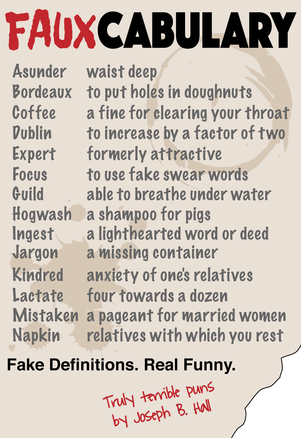
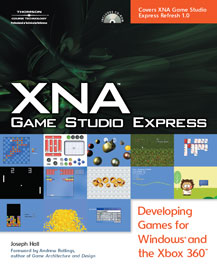



## Fauxcabulary <small>Fake Definitions. Real Funny.</small>

    
  <a href="https://leanpub.com/fauxcabulary" target="_blank" class="btn btn-primary">eBook</a>
  <a href="http://www.lulu.com/shop/http://www.lulu.com/shop/joseph-hall/fauxcabulary/paperback/product-22179468.html" target="_blank" class="btn btn-primary">Paperback</a>

<a href="http://fauxcabulary.org/" target="_blank">Fauxcabulary.org</a> was created to provide some insight into how my mind works. I know it sounds strange, but as folks talk (in person, on the phone, on radio, on TV, …) my thoughts process each of their words, along with every word combo with similar sounds, meaning, or spelling.

The people that live and work with me daily get to hear about 20% of those stray thoughts in the form of oft-risqué puns (although I’m sure it feels more like 90% to them).

In 2009, my wife told me to start writing my stupid puns down, and since I’m not good at following directions, I started my faux-cabulary list instead.

Peppered within the site, you’ll also find some random musings that aren’t directly related to the whole fauxcabulary theme, but do fit nicely with the stated goal of “provid[ing] some insight into how my mind works”.

I hope you enjoy this collection. New fauxcabulary words are posted on the website every day at midnight. The other content is added as it happens. So keep checking back.

-- Joe 
(<a href="https://twitter.com/groundh0g" target="_blank">ground&middot;h0g</a>)

<pre>Published on:  May 14, 2015
Publisher:     Hiive Books, LLC
eBook
  Printer:     Leanpub.com
  Page Count:  463 pages
Paperback
  Printer:     Lulu.com
  Page Count:  472 pages</pre>

## XNA Game Studio Express <small>Developing Games for Windows and the Xbox 360</small>

> **NOTE:** This book was published in 2007. In the context of game programming, that's an eternity ago. In fact, the technology on which this book is based was officially mothballed by Microsoft in 2014. I've moved on to an opensource, API-compatible framework called MonoGame. Everything in the book is applicable to MonoGame, but I'm actually in the process of writing a new series of books on MonoGame programming using MonoDevelop / Xamarin Studio. In short, I'd love the support, but if it were my dime, I wouldn't purchase this book now.

### About the Book

    
  <a href="http://amzn.to/1JuxvD8" target="_blank" class="btn btn-primary">Buy This Book</a>

This book is divided into four parts. Part one (“Building Blocks”, chapters 1 – 12) introduces you to the XNA technologies and takes you through the process of setting up and configuring your development environment to create games for Windows and the Xbox 360, and it explores the major feature areas of the XNA Framework APIs by developing example games that demonstrate each. Part two (“Genre Studies”, chapters 13 – 18) builds on what you learned in the earlier chapters to write (six) actual games. In part three (“Components, Libraries, and Tools”, chapters 19 – 24), you learn how to segment your code into generic component libraries so that you can reuse your work, rather than reinventing it with each new game. Part four (“Tasty Bits”, chapters 25 – 31) explores more advanced concepts like threading, performance tuning, and localization.

Each of the four parts of the book begins with an overview of what you can expect to learn in its chapters, and every chapter ends with review questions and exercises to help make sure that you understand the concepts that are covered. The games and example code in this book were designed with a focus on illustrating the concepts that are covered within the chapter in which they are developed. As a consequence, they are not polished, commercially-viable titles. But, they are a great place for you to explore and experiment with the XNA Framework, and they provide a good starting point for you to bring your own gaming visions to life.

### Audience

I would love to say that you should buy this book if you’re able to read and comprehend written text. I would love to say that you can pick up a book and a compiler and start writing games after just a weekend of reading. I can’t say that, though. I’ve made every attempt to make sure that someone who is new to game programming can easily follow the progression of ideas and concepts from introduction to implementation, while still keeping the interest of those programmers who have dabbled in game development or have written complete games, but this book will not teach you how to program.

If you have had any experience with writing programs (on any platform, in any language) you should be able to follow the examples in this book without any problems. If you don’t know what loops, variables, methods, and arrays are then it’s time to pick up a good introduction to the C# language to which you can refer as you read this book. Games are frequently trivialized since they lie squarely within the real of recreation and entertainment, but game programming is actually one of the most cerebral forms of programming that you’ll ever do.

I hope that I haven’t scared you off. If you have a passion for games, and you have a vision that you would like to see come to life, then I firmly believe that you can make it happen, and I believe that this book will help you. I just don’t want you to think that you’ll be writing the next Quake or Gran Turismo in a weekend, especially if you’ve never written a line of code in your life. Read the book. Answer the review questions. Work through the exercises. Modify the example code. By testing your assumptions, you’ll be able to know when you’ve mastered the material. Then you can combine those core concepts in different ways to create great games.

<pre>Published on:  September 6, 2007
Publisher:     Course Technology PTR (Cengage)
Page Count:    792 pages
Amazon Rating: 4.4 of 5.0 stars</pre>

