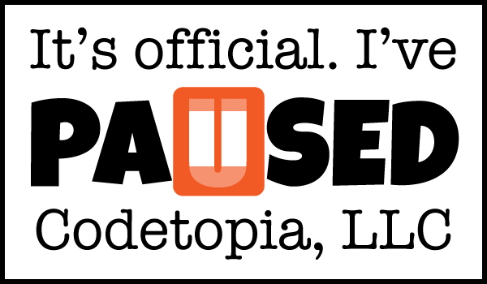



## Not Enough Hours ...

New job. New town.

For the foreseeable future, my Codetopia activities will be limited to the anual [game programming camp in North Carolina](camps/index.html) and work on the new [game programming book](https://leanpub.com/monogamecodecamps). I say "my Codetopia activities" because I do a heckuva lot more than just pay the bills!

Codetopia, LLC, was founded in 2006 as a vehicle for me to knock one more item off my bucket list -- start my own consulting company. I walked away from my 9-to-5 without a penny in savings, a plan, or even a client! In hindsight, it's not something that I would recommend to anyone looking to start their own business, but it worked out for me.

Since then, I've had more word-of-mouth work than I could handle. I took a short break in 2007 to work as the CTO of a ticket sales and service company, and I cut my commitments significantly after a health scare in 2010 -- dropping to a single client at a time.

## My New Home

Towards the end of March, 2015, I started my journey with a company called [ThoughtWorks](http://www.thoughtworks.com/). 

> ThoughtWorks is "a community of passionate individuals whose purpose is to revolutionize software design, creation and delivery, while advocating for positive social change."
>
> -- [About Us](http://www.thoughtworks.com/about-us)

What attracted me to ThoughtWorks was their fanatical adherence to software development practices that are typically only given lip service by most IT shops. I've been programming professionally for more than 25 years, but in this role, I'm the newbie.

Those that know me well, might be scratching their heads at the third pillar of ThoughtWork's mission statement to "[advocate passionately for social and economic justice](http://www.thoughtworks.com/social-justice)". How do I reconcile my worldview (equal opportunity) with that of the company (equal outcome)? 

The truth is that our goals aren't that different. We just have different ideas for the best way to achieve them. I'll join the throngs of closet conservatives within the collective who believe in empowering and equipping the individual -- as I establish myself in my new role and build a track record for adding measurable value while uniting teams.

## I'll Actually Be Doing More

When deciding to commit myself to this new endeavor, I didn't focus on the differences. I focused on the stark alignments of our goals.

> We are focused on helping our industry improve, and believe in sharing what we learn. We do this by writing books, blogging, running events, talking at conferences, and championing open source.
>
> -- [About Us](http://www.thoughtworks.com/about-us)

I find those bits to be the most compelling. My home office (in Atlanta, GA) encourages community involvement. Once I get the family settled into closer digs, my commute will be shorter and I'll be able to take a more active role in blogging my TDD / XP experiences, completing my new book(s), continuing my work in the OSS community, and engaging the locals!

I'm especially excited to have an opportunity to involve my girls in the experience as well, via initiatives like [@GirlsWhoCode](https://twitter.com/GirlsWhoCode), [@BlackGirlsCode](https://twitter.com/VolunteerBGCATL), and [@WomenWhoCode](https://twitter.com/WWCAtl).

Whether we pair with an existing organization or not, I'll likely blog about what my girls and I do together via [@GirlzAtPlay](https://twitter.com/girlzatplay) and [GirlsAtPlay.com](http://blog.girlsatplay.com). (Placeholder site, for now.)

